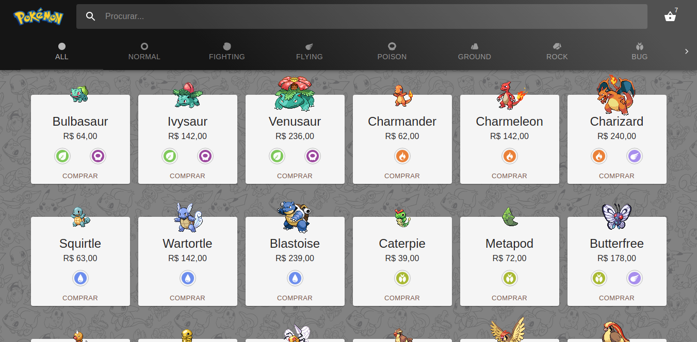
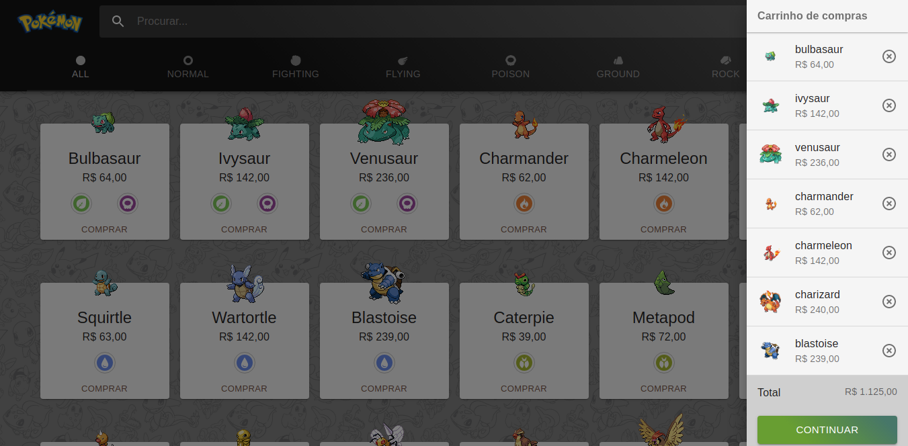
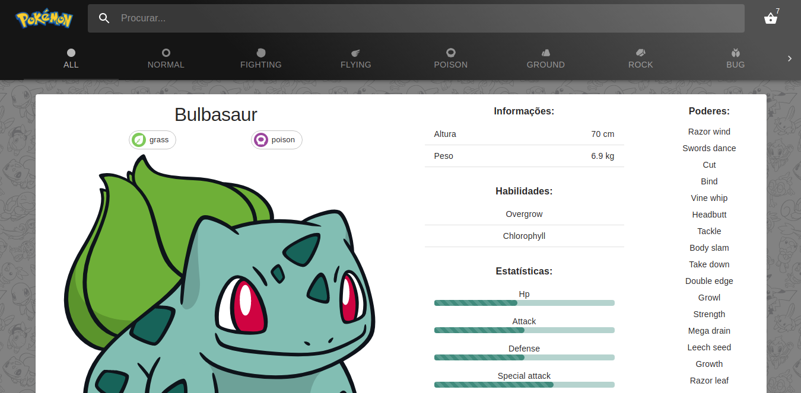
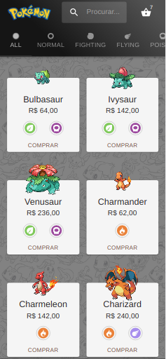
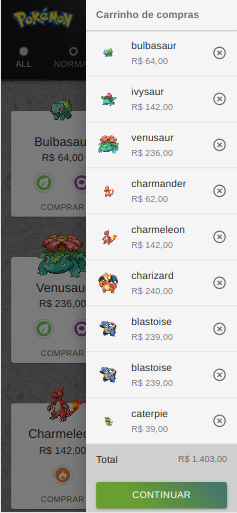
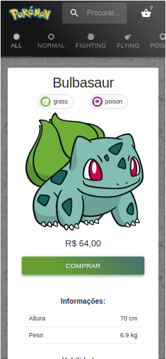

[](https://github.com/mxczpiscioneri/desafio-loja-pokemon/actions/workflows/react-build-githubpages.yml)
[](https://github.com/mxczpiscioneri/desafio-loja-pokemon/actions/workflows/react-test-coverage.yml)
[](https://codecov.io/gh/mxczpiscioneri/desafio-loja-pokemon)

# Pokémon Store 

Aplicação em ReactJS que simula um e-commerce de Pokémon.
As abas com os tipos de Pokémon simula outras lojas com estilos diferentes, mas com o mesmo comportamento.

## Pokémon
Os dados utilizados são da API [`https://pokeapi.co`](https://pokeapi.co)

#### Demonstração
Veja a aplicação rodando no endereço [`https://mxczpiscioneri.github.io/desafio-loja-pokemon`](https://mxczpiscioneri.github.io/desafio-loja-pokemon)

## Instalação

[-informational.svg?style=flat-square&logo=node.js)](https://nodejs.org/dist/latest-v10.x/docs/api/)
[](https://yarnpkg.com/lang/en/docs/install)
[](https://reactjs.org/blog/2020/10/20/react-v17.html)

#### Clonar repositório
```sh
git clone https://github.com/mxczpiscioneri/desafio-loja-pokemon.git
```

#### Instalar dependências
```sh
yarn
```

#### Rodar o projeto
```sh
yarn start
```

#### Rodar os testes
```sh
yarn lint
yarn test
yarn test:coverage
yarn cypress:run
```

#### Acesse:
[`http://localhost:3000/desafio-loja-pokemon`](http://localhost:3000/desafio-loja-pokemon)


## Env
Defina as variáveis de ambiente no arquivo `.env`.
```
REACT_APP_API_URL= // URL da API para consumir os pokemon
REACT_APP_API_TIMEOUT=30000 // Tempo de timeout da api em milissegundos
```

## Deploy
O deploy está sendo realizado automaticamente pelo Github Actions no Github Pages quando o código é enviado para a `branch master`, mas também é possível executar pelo comando abaixo.
```sh
yarn deploy
```

## Pipelines Github Actions CI/CD

#### CI
- Install
- Lint
- Test coverage
- Generate coverage report
- Upload coverage to Codecov

#### CD
- Install
- Build page
- Deploy to gh-pages

## Telas






